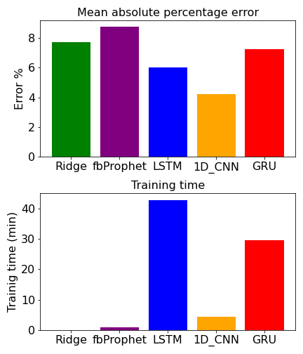

## Power Absorbtion Prediction project

This is a time series project in wich I predict the power absorbtion in Italy from June 2018 till March 2020.
The data for training and testing are taken from a Kaggle dataset called "Western Europe Power Consumption" (dataset [here](https://www.kaggle.com/francoisraucent/western-europe-power-consumption)). 
The original signal is a timeseries hourly discretized of power absorbtion in Megawatt:

For prediction I used different algorithms and then I compared the performances. The used algorithms are:
1) Ridge regression 
2) Facebook Prophet 
3) Long Short Term Memory (LSTM) 
4) Convolutional Neural Networks 1D (CNN) 
3) Gated Recurrent Unit (GRU) 

The Ridge is a ML regression method very fast to train and with (usually) good performances. Facebook Prophet is a ANN model 
developed by facebook; it is to me a black box, but I used also this model to have a comparison with "home made" algorithms.
LSTM and GRU are recurrent neural network particularly suitable for time series because they have a kind of memory recalled to
gather information from the past and have a wiser prediction in the future. CNN 1D are convolutional neural networks used generally for
sound signals or any kind of one-dimensional signal; since the timeseries can be seen as a 1D signal, then CNN 1D are suitable for
predicting this signal in the future. CNN don't have a memory like RNN, but they have kernel filters that extract features. Since the filter
spans over many time steps in the past, it behaves somehow as a memory. 
The following pictures show the mean absolute percentage error (SMAPE) and the training time for all considered algorithms:

CNN is the best method: the most precise with a relativelly low training time. Off course, if you don't have much time for training but
still want to have a decent result, I would suggest Ridge. What do you think about? 

The Jupyter notebook of this project can be found [here](./notebooks/time_series_final_prj.ipynb)

