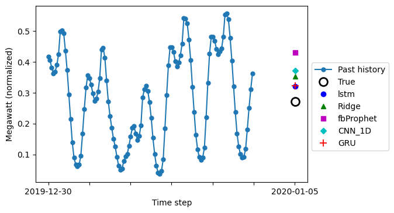

<ul style="color:blue" class="problem_size">Facts:
<li>A land like Italy absorbes on average 33GW 
    of electrical energy each minute</li>
<li>The energy demand has huge fluctuaction around the mean ...</li>
</ul>

 
Question: How can I predict the power absorption?  
Regression methods or Deep Learning 

    
    

    
Question: Which method is better?   
Not easy answer ...  

Let's compare some models to find out the answer  

### Where to start?

###

Power absorbtion hour by hour

<ul>
<li>Information not well human readable ... too many values</li>
<li>Target of models: discover seasonalities and deliver good prediction</li>
<li>Training: 30000 inputs, Test: 15000 inputs</li>
</ul>
<!--/div>

   

Power absorbtion weekly averaged

              

### Chosen models

###

|Model | Kind |  Has memory? | How learns |
| :---:| :---: | :---: | :---: |
| Ridge | shallow | NO | whole train (once 30000 inputs) 
| FB Prophet | shallow  | NO | whole train (once 30000 inputs)| 
| LSTM | deep  | YES | subsets (many 120 inputs)| 
| GRU| deep | YES | subsets (many 120 inputs)| 
| CNN 1D| deep | NO but HAS FILTERS | subset (many 120 inputs)|

### How do the models do...

###
 

|Model | Features | Inputs Dim|  Output | 
|:---:|:---:|:---:|:---:|
| Ridge|7  hour; day;   week;  day_of_week;   month;  year; holidays |(1x7)| 1 Power at the   selected date|
| FB Prophet|1  Timestamp | (1x1)| 1  Power at the   selected date|
| LSTM GRU CNN 1D|2   Power; holidays |(120x2)| 1 Power 24 hours   in the future|

### Architecture of the models

###

<!--div class="architecture">

 

Ridge

 

    

 

fb Prophet

 
    
    
    

 

Long-Short Term Memory

 

 

1D convolutional NN
 
  

    

  

Gated Recurrent Unit

</div-->

### How do the 5 models perform ...

###
<!--p class="results">
Input: 120 hours in the past (5 day)  
Output: Power absorbtion 24 hours in the future</p-->

<!--{ width=27%}-->

 

<!--{ width=30%}-->
 

<ul>
<li>The input for LSTM, CNN and GRU is the history curve </li>
<li>The input for Ridge and fb Prophet is the target date </li>
<li>Output: Power absorption at target date</li>
</ul>

### What's the best model?

###

    

  

::: incremental
- CNN 1D is the most performant

 

- Ridge is trained in less than  
  one minute

 

 

:::

  
    

    

 
    
::: incremental
* If you need "high" precision ->  
    go for <a style="font-weight: bold;">CNN 1D</a>

 

* If you need a "rapid" answer ->  
  go for <a style="font-weight: bold;">Ridge</a>
:::  

    

    

### 

 
<h2 color="blue">Thanks!</h2>
 
<ul font-weight="bold"> Many thanks to: </ul>

<ul>
 
<li> Agentur für Arbeit - Düsseldorf</li>
<li> Spiced Academy </li>
<li> Malte and Sam </li>
<li> My mates: JJJLLM</li>
<li> Kathrin </li>
<li>[Net2Vis - Ulm University](https://viscom.net2vis.uni-ulm.de/)</li>
</ul>

<!--ref class="smallfont" url("https://viscom.net2vis.uni-ulm.de/")>Net2Vis for architecture representations</ref-->

